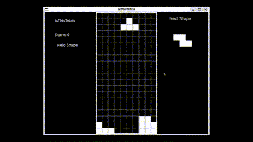

# IsThisTetris

[](https://www.pygame.org)
[](LICENSE)

IsThisTetris is a simple implementation of the classic Tetris game using Python and Pygame. (It's BnW on purpose)



### Controls

Standard controls

```plaintext
Left Arrow  - Move left
Right Arrow - Move right
Down Arrow  - Move down (faster drop)
Up Arrow    - Rotate clockwise
C Key       - Hold current for later use
```

### Scoring

 Earn points for each line cleared. More points are awarded for clearing multiple lines simultaneously.

### Play

1. You need ```pygame``` installed:

    ```bash
    pip install pygame
    ```

2. Run the game on your terminal:

    ```bash
    python3 IsThisTetris.py
    ```
